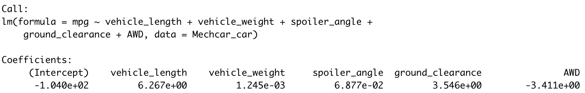
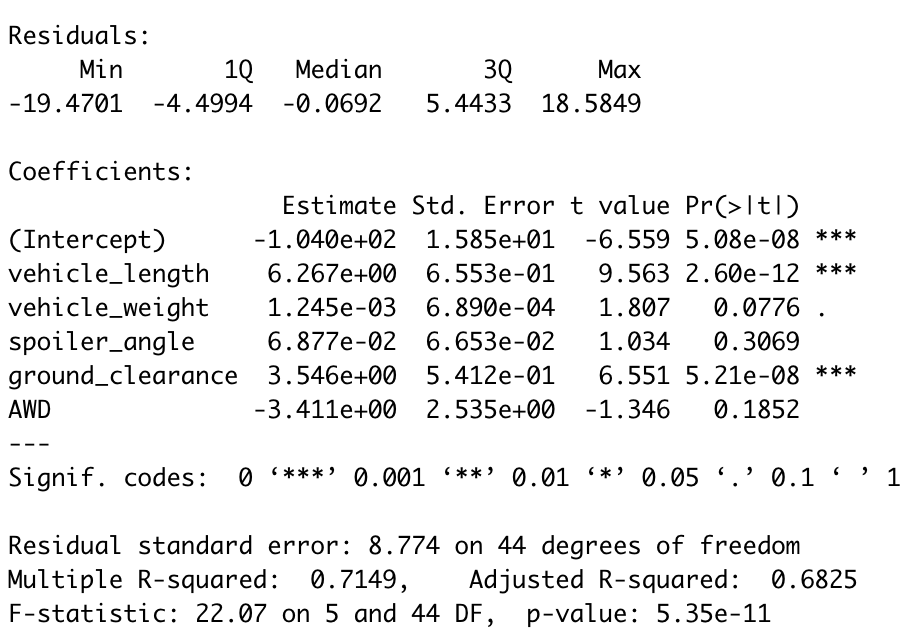
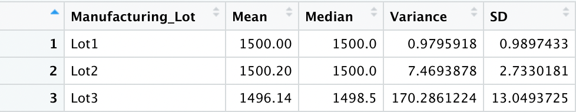
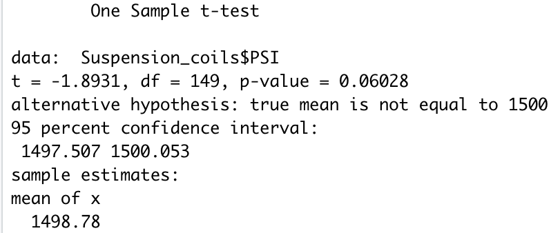
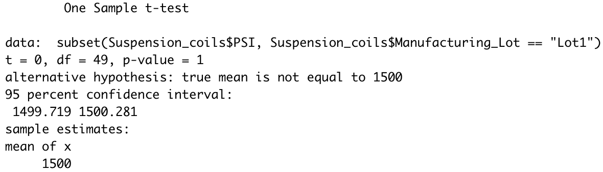
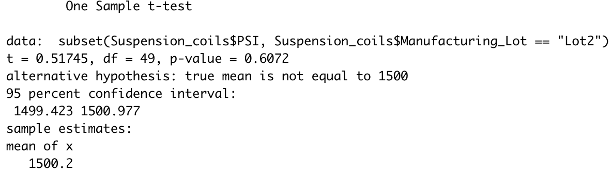
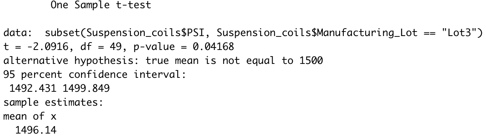

# MechaCar Statistical Analysis

In this analysis using R, I delve into two given datasets to conduct statistical analysis to help a company in its decision-making process.

## Linear Regression to Predict MPG
In this section, I create a multiple linear regression model taking fuel efficiency (mpg) as the dependent variable and taking the independent variables as vehicle length, vehicle weight, spoiler angle, ground clearance, and AMD. Using the results of the multiple regression model, I test the statistical significance of the variables using the p-value. I conclude this section of the analysis by answering three questions according to figure 1:

**Figure 1: Mutltiple Regression Model**

1. Which variables/coefficients provided a non-random amount of variance to the mpg values in the dataset?
		
       - With a significance level of 0.05 the intercept, vehicle length, and ground clearance	produce statistically significant results. In other words, I can reject the null hypothesis stating that these variables provide a non-random amount of variance to the mpg values.

1. Is the slope of the linear model considered to be zero? Why or why not?
	- Since this is a multiple regression model, it will have several slopes that need to be considered. In testing for statistical significance what I am actually is testing is whether the independent variables have an effect on the dependent variable. This is how the hypothesis is constructed for the multiple regression model.	 
	 
	Ho: α0 = α1 = α2 = ... = αn = 0

	Ha: α0 ≠ α1 ≠ α2 ≠ ... ≠ αn ≠ 0
	
	
	Where the alpha values are the slope values of the independent variables. In this case the independent variables for vehicle weight, spoiler angle and AMD may have a zero slope because I fail to reject the null hypothesis. 

1. Does this linear model predict mpg of MechaCar prototypes effectively? Why or why not?

	- This model has a relatively high adjusted R-square value (0.6825) which means that the input variables are indicating a good fit for the model. However, we can say there is room for improvement by adjusting the model with new variables and/or excluding variables that don't produce a significant result.
## Summary Statistics on Suspension Coils 

In this section of the analysis, I summarize the suspension coils data by finding the mean, median, variance, and standard deviation of each vehicle according to the manufacturing lot. And also conduct a similar analysis for all the manufacturing lots.

**Table 1: Individual Manufacturing Lot Statistics Summary**

**Table 2: Total Manufacturing Lot Statistics Summary**

The design specifications for MechaCar suspension coils underscore that the variance of the suspension coils must not exceed 100 pounds per square inch (PSI). According to my results, the total manufacturing lot variance, 62.29, meets the design specifications. Moreover, individually checking the manufacturing lots; the variance for the third manufacturing lot, 170.29, doesn't meet the design specifications, while the other two manufacturing lots meet the variance specifications. The resaon for this is asscoicated with the difference in PSI values with the manufacturing lots. 

## T-Tests on Suspension Coils

I continue the analysis by conducting a one-sample t-test to if all manufacturing lots and each manufacturing lot are statistically different from the population mean of 1,500 PSI. I analyze each p-value according to a significance level of 0.05.

* The manufacturing lots aren't statistically significant from the population mean of 1,500 PSI. Therefore, I can't reject the null hypothesis, and this would mean that the two means are statistically similar.

**Figure 2: One-Sample T-Test for All Manufacturing Lots**

The first manufacturing lot isn't also statistically significant from the population mean of 1,500 PSI. Therefore, I can't reject the null hypothesis, and this would mean that the two means are statistically similar.

**Figure 3: One-Sample T-Test for the First Manufacturing Lot**

* The second manufacturing lot isn't also statistically significant from the population mean of 1,500 PSI. Therefore, I can't reject the null hypothesis, and this would mean that the two means are statistically similar. 

**Figure 3: One-Sample T-Test for the Second Manufacturing Lot**

* The third manufacturing lot is statistically significant from the population mean of 1,500 PSI. Therefore, I can reject the null hypothesis, and this would mean that the two means are statistically different. 

**Figure 4: One-Sample T-Test for the Third Manufacturing Lot**

## Study Design: MechaCar vs Competition

I would start this study by analyzing what key metrics I can utilize and how I can extract those key metrics. Since I will be building a product for my clients I will start by conducting both qualitative and quantitative surveys. I will research historical data to see what key metrics the manufacturing company analyzed and how those key metrics played a role in building efficiency and customer retention. I will make sure this analysis is conducted according to a random sample. Since I will have multiple variables I will build a multiple regression model. In this case, my null and alternative hypothesis would be as follow:
Ho: α0 = α1 = α2 = ... = αn = 0

Ha: α0 ≠ α1 ≠ α2 ≠ ... ≠ αn ≠ 0

According to the results of the multiple regression model, I will test each key metric as a dependent variable to adjust my model to find a good fit. More precisely with the results of the multiple regression model, I will conduct A/B tests with each significant key metric to further understand whether those metrics actually do produce a significant result in the product. I will also adjust the independent variables that make the key metrics a good fit model. And try to come to a conclusion in totality with both the key metrics and the independent variables. Afterwards I will recommend to record data from these keys metrics for several months to see whether they are making a change, if not pivot to other assessment metrics.

